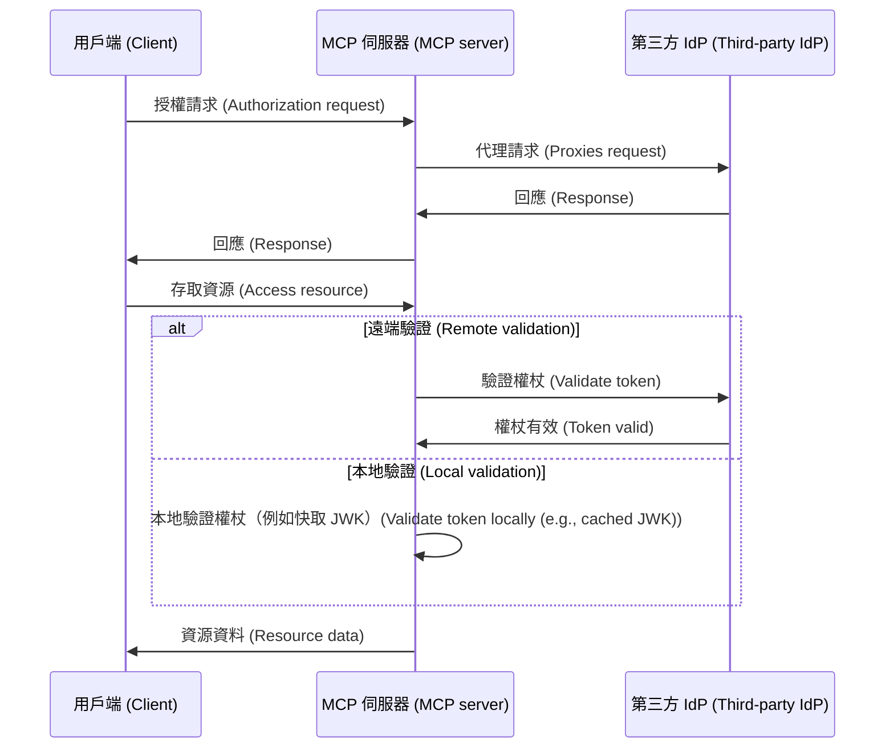

# 在 MCP Auth 與其他解決方案之間的選擇

MCP 生態系正在演進。隨著 Model Context Protocol (MCP) 規範從「授權伺服器」模式轉向全新的「資源伺服器 + 第三方身分提供者 (IdP, Identity Provider)」模型，了解不同整合方案目前與未來的適用情境變得格外重要。

本頁將概述 mcp-auth 與其他主流解決方案的主要差異，協助你為專案選擇最佳方案。

## 背景：代理 (Proxy) 模式 vs. IdP 整合 \{#background-proxy-approach-vs-idp-integration}

現有多數 MCP 驗證 (Authentication) 解決方案採用「代理 (Proxy) 模式」。在此模型下，MCP 伺服器會將授權 (Authorization) 請求代理給第三方身分提供者 (IdP)，實際上充當用戶端與 IdP 之間的中介。

**代理 (Proxy) 模式（[03-26 規範](https://modelcontextprotocol.io/specification/2025-03-26/basic/authorization)）**

雖然這種方式符合現行（2025-03-26）MCP 規範，但本質上是一種權宜之計。它假設 MCP 伺服器同時扮演授權伺服器角色，這並非最新草案規範的發展方向。

**MCP Auth / 未來規範（資源伺服器 + 第三方 IdP）**

```mermaid
sequenceDiagram
    participant Client as 用戶端 (Client)
    participant MCP_Server as MCP 伺服器 (MCP server)
    participant ThirdParty_IdP as 第三方 IdP (Third-party IdP)

    Client->>ThirdParty_IdP: 授權請求 (Authorization request)
    ThirdParty_IdP->>Client: 權杖 (Token)
    Client->>MCP_Server: 存取資源（附帶權杖）(Access resource (with token))
    alt 遠端驗證 (Remote validation)
        MCP_Server->>ThirdParty_IdP: 驗證權杖 (Validate token)
        ThirdParty_IdP->>MCP_Server: 權杖有效 (Token valid)
    else 本地驗證 (Local validation)
        MCP_Server->>MCP_Server: 本地驗證權杖（例如快取 JWK）(Validate token locally (e.g., cached JWK))
    end
    MCP_Server->>Client: 資源資料 (Resource data)
```

即將到來的 MCP 規範[將授權責任轉移給專責的第三方 IdP](https://github.com/modelcontextprotocol/modelcontextprotocol/issues/205)。在此模型下，MCP 伺服器僅作為資源伺服器，所有授權端點皆直接來自第三方 IdP。

## 為什麼選擇 MCP Auth？\{#why-choose-mcp-auth}

- 規範對齊：MCP Auth 直接遵循最新草案方向，是唯一同時相容 03-26 規範與未來規範的解決方案。
- 不再需要權宜之計：MCP Auth 讓第三方 IdP 處理所有授權，無需再讓 MCP 伺服器充當授權伺服器代理，完全符合新規範設計初衷。
- 不綁定特定供應商：MCP Auth 可搭配任何符合標準的 OAuth 2.0 / OIDC 供應商。
- 平順轉換：MCP Auth 透過 OAuth 2.0 授權伺服器中繼資料，原樣返回所有第三方端點，讓整合現在簡單、未來也能無縫銜接。
- 開發者體驗：提供教學、工具，以及即將推出的 [OAuth 2.0 受保護資源中繼資料 (Protected Resource Metadata)](https://auth.wiki/protected-resource-metadata) 等功能，讓 MCP 伺服器開發更輕鬆。

| 功能 (Feature)                     | 代理解決方案 (Proxy solutions) | MCP Auth |
| ---------------------------------- | ----------------------------- | -------- |
| 相容 03-26 規範                   | ✅                            | ✅       |
| 相容未來規範                       | ❌                            | ✅       |
| 直接支援第三方 IdP                 | ❌（僅權宜之計）               | ✅       |
| 不綁定特定供應商                   | 受限[^1]                      | 是       |
| 隨時可轉換                         | ❌                            | ✅       |

如果你現在就需要支援第三方 IdP，並希望未來能無縫銜接新規範，MCP Auth 是推薦方案。基於代理的做法可能很快就會被棄用，或需大幅重構。

[^1]: 某些代理解決方案可能硬編碼特定參數或端點，降低彈性。