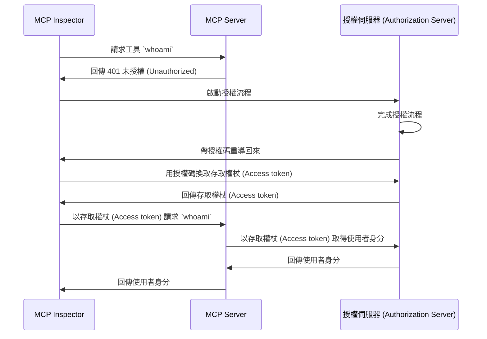

import TabItem from '@theme/TabItem';
import Tabs from '@theme/Tabs';

import SetupOauth from './_setup-oauth.mdx';
import SetupOidc from './_setup-oidc.mdx';

# 教學：我是誰？ (Tutorial: Who am I?)

本教學將引導你設定 MCP Auth，以驗證 (Authentication) 使用者並從授權 (Authorization) 伺服器取得其身分資訊。

完成本教學後，你將會：

- ✅ 基本瞭解如何使用 MCP Auth 進行使用者驗證 (Authentication)。
- ✅ 擁有一個 MCP 伺服器，並能提供工具來取得使用者身分資訊。

## 概覽 (Overview) \{#overview}

本教學將涉及以下元件：

- **MCP 伺服器**：一個簡單的 MCP 伺服器，使用 MCP 官方 SDK 處理請求。
- **MCP inspector**：MCP 伺服器的視覺化測試工具，同時作為 OAuth / OIDC 用戶端，啟動授權流程並取得存取權杖 (Access token)。
- **授權伺服器 (Authorization server)**：一個 OAuth 2.1 或 OpenID Connect 提供者，負責管理使用者身分並簽發存取權杖 (Access token)。

以下是這些元件間互動的高階圖示：



## 瞭解你的授權伺服器 (Understand your authorization server) \{#understand-your-authorization-server}

### 取得使用者身分資訊 (Retrieving user identity information) \{#retrieving-user-identity-information}

為完成本教學，你的授權伺服器應提供 API 以取得使用者身分資訊：

<Tabs groupId="provider">
<TabItem value="logto" label="Logto">

[Logto](https://logto.io) 是一個 OpenID Connect 提供者，支援標準的 [userinfo endpoint](https://openid.net/specs/openid-connect-core-1_0.html#UserInfo) 來取得使用者身分資訊。

要取得可用於 userinfo endpoint 的存取權杖 (Access token)，至少需兩個權限範圍 (Scopes)：`openid` 與 `profile`。你可以繼續閱讀，稍後會介紹權限範圍設定。

</TabItem>
<TabItem value="keycloak" label="Keycloak">

[Keycloak](https://www.keycloak.org) 是一個開源身分與存取管理解決方案，支援多種協議，包括 OpenID Connect (OIDC)。作為 OIDC 提供者，它實作了標準的 [userinfo endpoint](https://openid.net/specs/openid-connect-core-1_0.html#UserInfo) 以取得使用者身分資訊。

要取得可用於 userinfo endpoint 的存取權杖 (Access token)，至少需兩個權限範圍 (Scopes)：`openid` 與 `profile`。你可以繼續閱讀，稍後會介紹權限範圍設定。

</TabItem>
<TabItem value="oidc" label="OIDC">

大多數 OpenID Connect 提供者都支援 [userinfo endpoint](https://openid.net/specs/openid-connect-core-1_0.html#UserInfo) 以取得使用者身分資訊。

請查閱你的提供者文件，確認是否支援此 endpoint。如果你的提供者支援 [OpenID Connect Discovery](https://openid.net/specs/openid-connect-discovery-1_0.html)，也可檢查 discovery 文件（`.well-known/openid-configuration` 回應）中是否包含 `userinfo_endpoint`。

要取得可用於 userinfo endpoint 的存取權杖 (Access token)，至少需兩個權限範圍 (Scopes)：`openid` 與 `profile`。請查閱你的提供者文件，瞭解權限範圍與使用者身分宣告 (Claims) 的對應關係。

</TabItem>
<TabItem value="oauth" label="OAuth 2">

雖然 OAuth 2.0 沒有定義標準方式來取得使用者身分資訊，許多提供者會實作自有 endpoint。請查閱你的提供者文件，瞭解如何使用存取權杖 (Access token) 取得使用者身分資訊，以及在啟動授權流程時需帶哪些參數來取得該存取權杖。

</TabItem>
</Tabs>

### 動態用戶端註冊 (Dynamic Client Registration) \{#dynamic-client-registration}

本教學不強制需要動態用戶端註冊，但如果你想自動化 MCP 用戶端在授權伺服器的註冊流程，這會很有幫助。詳情請參閱 [是否需要動態用戶端註冊？](../../provider-list#is-dcr-required)。

## 設定 MCP 伺服器 (Set up the MCP server) \{#set-up-the-mcp-server}

我們將使用 [MCP 官方 SDK](https://github.com/modelcontextprotocol) 建立一個 MCP 伺服器，並實作一個 `whoami` 工具，從授權伺服器取得使用者身分資訊。

### 建立新專案 (Create a new project) \{#create-a-new-project}

<Tabs groupId="sdk">
<TabItem value="python" label="Python">

```bash
mkdir mcp-server
cd mcp-server
uv init # 或使用 `pipenv` 或 `poetry` 建立新虛擬環境
```

</TabItem>
<TabItem value="node" label="Node.js">

建立新的 Node.js 專案：

```bash
mkdir mcp-server
cd mcp-server
npm init -y # 或使用 `pnpm init`
npm pkg set type="module"
npm pkg set main="whoami.js"
npm pkg set scripts.start="node whoami.js"
```

</TabItem>
</Tabs>

### 安裝 MCP SDK 與相依套件 (Install the MCP SDK and dependencies) \{#install-the-mcp-sdk-and-dependencies}

<Tabs groupId="sdk">
<TabItem value="python" label="Python">

```bash
pip install "mcp[cli]" starlette uvicorn
```

或使用你偏好的套件管理工具，如 `uv` 或 `poetry`。

</TabItem>
<TabItem value="node" label="Node.js">

```bash
npm install @modelcontextprotocol/sdk express
```

或使用你偏好的套件管理工具，如 `pnpm` 或 `yarn`。

</TabItem>
</Tabs>

### 建立 MCP 伺服器 (Create the MCP server) \{#create-the-mcp-server}

首先，讓我們建立一個實作 `whoami` 工具的 MCP 伺服器。

<Tabs groupId="sdk">
<TabItem value="python" label="Python">

建立名為 `whoami.py` 的檔案，並加入以下程式碼：

```python
from mcp.server.fastmcp import FastMCP
from starlette.applications import Starlette
from starlette.routing import Mount
from typing import Any

mcp = FastMCP("WhoAmI")

@mcp.tool()
def whoami() -> dict[str, Any]:
    """回傳目前使用者資訊的工具。"""
    return {"error": "Not authenticated"}

app = Starlette(
    routes=[Mount('/', app=mcp.sse_app())]
)
```

以以下指令啟動伺服器：

```bash
uvicorn whoami:app --host 0.0.0.0 --port 3001
```

</TabItem>
<TabItem value="node" label="Node.js">

:::note
由於目前 MCP inspector 尚未支援授權流程，我們將採用 SSE 方式設定 MCP 伺服器。待 MCP inspector 支援授權流程後，會更新此處程式碼。
:::

你也可以選擇使用 `pnpm` 或 `yarn`。

建立名為 `whoami.js` 的檔案，並加入以下程式碼：

```js
import { McpServer } from '@modelcontextprotocol/sdk/server/mcp.js';
import { SSEServerTransport } from '@modelcontextprotocol/sdk/server/sse.js';
import express from 'express';

// 建立 MCP 伺服器
const server = new McpServer({
  name: 'WhoAmI',
  version: '0.0.0',
});

// 新增一個回傳目前使用者資訊的工具
server.tool('whoami', async () => {
  return {
    content: [{ type: 'text', text: JSON.stringify({ error: 'Not authenticated' }) }],
  };
});

// 以下為 MCP SDK 文件的樣板程式碼
const PORT = 3001;
const app = express();

const transports = {};

app.get('/sse', async (_req, res) => {
  const transport = new SSEServerTransport('/messages', res);
  transports[transport.sessionId] = transport;

  res.on('close', () => {
    delete transports[transport.sessionId];
  });

  await server.connect(transport);
});

app.post('/messages', async (req, res) => {
  const sessionId = String(req.query.sessionId);
  const transport = transports[sessionId];
  if (transport) {
    await transport.handlePostMessage(req, res, req.body);
  } else {
    res.status(400).send('No transport found for sessionId');
  }
});

app.listen(PORT);
```

以以下指令啟動伺服器：

```bash
npm start
```

</TabItem>
</Tabs>

## 檢查 MCP 伺服器 (Inspect the MCP server) \{#inspect-the-mcp-server}

### 下載並執行 MCP inspector (Clone and run MCP inspector) \{#clone-and-run-mcp-inspector}

現在 MCP 伺服器已啟動，我們可以使用 MCP inspector 檢查 `whoami` 工具是否可用。

由於目前實作上的限制，我們 fork 了 [MCP inspector](https://github.com/mcp-auth/inspector)，讓其在驗證 (Authentication) 與授權 (Authorization) 上更靈活且可擴展。我們也已向原始倉庫提交 pull request。

執行 MCP inspector，請使用以下指令（需安裝 Node.js）：

```bash
git clone https://github.com/mcp-auth/inspector.git
cd inspector
npm install
npm run dev
```

然後在瀏覽器開啟 `http://localhost:6274/`（或終端機顯示的其他網址）以進入 MCP inspector。

### 連接 MCP inspector 與 MCP 伺服器 (Connect MCP inspector to the MCP server) \{#connect-mcp-inspector-to-the-mcp-server}

在繼續之前，請檢查 MCP inspector 的以下設定：

- **Transport Type**：設為 `SSE`。
- **URL**：設為你的 MCP 伺服器網址，本例應為 `http://localhost:3001/sse`。

現在你可以點擊「Connect」按鈕，檢查 MCP inspector 是否能連接 MCP 伺服器。如果一切正常，應會看到 MCP inspector 顯示「Connected」狀態。

### 檢查點：執行 `whoami` 工具 (Checkpoint: Run the `whoami` tool) \{#checkpoint-run-the-whoami-tool}

1. 在 MCP inspector 上方選單點選「Tools」分頁。
2. 點擊「List Tools」按鈕。
3. 你應該會在頁面上看到 `whoami` 工具，點擊它以開啟工具詳情。
4. 右側會出現「Run Tool」按鈕，點擊執行工具。
5. 你應該會看到工具回傳結果為 JSON：`{"error": "Not authenticated"}`。


## 與授權伺服器整合 (Integrate with your authorization server) \{#integrate-with-your-authorization-server}

完成本節需考慮以下幾點：

<details>
<summary>**你的授權伺服器簽發者 (Issuer) URL**</summary>

通常是你的授權伺服器基礎網址，例如 `https://auth.example.com`。有些提供者可能會有路徑，如 `https://example.logto.app/oidc`，請參閱你的提供者文件。

</details>

<details>
<summary>**如何取得授權伺服器中繼資料 (Metadata)**</summary>

- 若你的授權伺服器符合 [OAuth 2.0 授權伺服器中繼資料 (RFC 8414)](https://datatracker.ietf.org/doc/html/rfc8414) 或 [OpenID Connect Discovery](https://openid.net/specs/openid-connect-discovery-1_0.html)，可直接用 MCP Auth 內建工具自動取得中繼資料。
- 若不符合上述標準，需手動在 MCP 伺服器設定中指定中繼資料網址或 endpoint，請查閱你的提供者文件。

</details>

<details>
<summary>**如何將 MCP inspector 註冊為授權伺服器用戶端**</summary>

- 若你的授權伺服器支援 [動態用戶端註冊 (Dynamic Client Registration)](https://datatracker.ietf.org/doc/html/rfc7591)，可略過此步驟，MCP inspector 會自動註冊。
- 若不支援，需手動將 MCP inspector 註冊為用戶端。

</details>

<details>
<summary>**如何取得使用者身分資訊，以及如何設定授權請求參數**</summary>

- 對於 OpenID Connect 提供者：通常需在授權流程請求至少 `openid` 與 `profile` 權限範圍 (Scopes)。這可確保授權伺服器回傳的存取權杖 (Access token) 具備存取 [userinfo endpoint](https://openid.net/specs/openid-connect-core-1_0.html#UserInfo) 所需權限。

  注意：部分提供者可能不支援 userinfo endpoint。

- 對於 OAuth 2.0 / OAuth 2.1 提供者：請查閱你的提供者文件，瞭解如何用存取權杖 (Access token) 取得使用者身分資訊，以及啟動授權流程時需帶哪些參數。

</details>

雖然每個提供者可能有不同需求，以下步驟將引導你整合 MCP inspector 與 MCP 伺服器，並進行提供者專屬設定。

### 註冊 MCP inspector 為用戶端 (Register MCP inspector as a client) \{#register-mcp-inspector-as-a-client}

<Tabs groupId="provider">
<TabItem value="logto" label="Logto">

與 [Logto](https://logto.io) 整合非常簡單，因為它是支援標準 [userinfo endpoint](https://openid.net/specs/openid-connect-core-1_0.html#UserInfo) 的 OpenID Connect 提供者。

由於 Logto 尚未支援動態用戶端註冊，你需手動將 MCP inspector 註冊為 Logto 租戶的用戶端：

1. 開啟 MCP inspector，點擊「OAuth Configuration」按鈕。複製 **Redirect URL (auto-populated)**，例如 `http://localhost:6274/oauth/callback`。
2. 登入 [Logto Console](https://cloud.logto.io)（或你的自架 Logto Console）。
3. 進入「應用程式」分頁，點擊「建立應用程式」。頁面底部點「不使用框架建立應用程式」。
4. 填寫應用程式資訊，然後點擊「建立應用程式」：
   - **選擇應用程式類型**：選「單頁應用程式」。
   - **應用程式名稱**：如「MCP Inspector」。
5. 在「設定 / Redirect URIs」區塊，貼上剛才複製的 **Redirect URL (auto-populated)**，然後點擊底部「儲存變更」。
6. 頁面上方會看到「App ID」，請複製。
7. 回到 MCP inspector，將「App ID」貼到「OAuth Configuration」的「Client ID」欄位。
8. 在「Auth Params」欄位輸入 `{"scope": "openid profile email"}`，確保 Logto 回傳的存取權杖 (Access token) 具備存取 userinfo endpoint 所需權限。

</TabItem>
<TabItem value="keycloak" label="Keycloak">

[Keycloak](https://www.keycloak.org) 是一個開源身分與存取管理解決方案，支援 OpenID Connect 協議。

雖然 Keycloak 支援動態用戶端註冊，但其註冊 endpoint 不支援 CORS，導致大多數 MCP 用戶端無法直接註冊。因此需手動註冊。

:::note
Keycloak 可用多種方式安裝（[官方說明](https://www.keycloak.org/guides#getting-started)），本教學以 Docker 快速安裝為例。
:::

設定 Keycloak 並進行相關配置：

1. 依 [官方文件](https://www.keycloak.org/getting-started/getting-started-docker) 用 Docker 啟動 Keycloak：

```bash
docker run -p 8080:8080 -e KC_BOOTSTRAP_ADMIN_USERNAME=admin -e KC_BOOTSTRAP_ADMIN_PASSWORD=admin quay.io/keycloak/keycloak:26.2.4 start-dev
```

2. 進入 Keycloak 管理後台 (http://localhost:8080/admin)，以以下帳密登入：

   - 使用者名稱：`admin`
   - 密碼：`admin`

3. 建立新 Realm：

   - 左上角點「Create Realm」
   - 「Realm name」填入 `mcp-realm`
   - 點「Create」

4. 建立測試使用者：

   - 左側選單點「Users」
   - 點「Create new user」
   - 填寫使用者資訊：
     - Username：`testuser`
     - 名字與姓氏可任意填
   - 點「Create」
   - 在「Credentials」分頁設定密碼並取消「Temporary」

5. 註冊 MCP Inspector 為用戶端：

   - 開啟 MCP inspector，點擊「OAuth Configuration」按鈕。複製 **Redirect URL (auto-populated)**，如 `http://localhost:6274/oauth/callback`。
   - 在 Keycloak 管理後台，左側選單點「Clients」
   - 點「Create client」
   - 填寫用戶端資訊：
     - Client type：選「OpenID Connect」
     - Client ID：填 `mcp-inspector`
     - 點「Next」
   - 「Capability config」頁面：
     - 確認「Standard flow」已啟用
     - 點「Next」
   - 「Login settings」頁面：
     - 貼上 MCP Inspector callback URL 至「Valid redirect URIs」
     - 「Web origins」填入 `http://localhost:6274`
     - 點「Save」
   - 複製「Client ID」（即 `mcp-inspector`）

6. 回到 MCP Inspector：
   - 將複製的 Client ID 貼到「OAuth Configuration」的「Client ID」欄位
   - 「Auth Params」欄位輸入以下內容以請求必要權限範圍：

```json
{ "scope": "openid profile email" }
```

</TabItem>
<TabItem value="oidc" label="OIDC">

:::note
這是通用 OpenID Connect 提供者整合指引，請查閱你的提供者文件以獲得細節。
:::

若你的 OpenID Connect 提供者支援動態用戶端註冊，可直接跳至第 8 步設定 MCP inspector；否則需手動註冊：

1. 開啟 MCP inspector，點擊「OAuth Configuration」按鈕。複製 **Redirect URL (auto-populated)**，如 `http://localhost:6274/oauth/callback`。
2. 登入你的 OpenID Connect 提供者後台。
3. 進入「應用程式」或「用戶端」區塊，建立新應用程式或用戶端。
4. 若需選擇用戶端類型，請選「單頁應用程式」或「公開用戶端」。
5. 建立應用程式後，設定 redirect URI，貼上 MCP inspector 的 **Redirect URL (auto-populated)**。
6. 找到新應用程式的「Client ID」或「Application ID」並複製。
7. 回到 MCP inspector，將「Client ID」貼到「OAuth Configuration」的「Client ID」欄位。
8. 標準 OIDC 提供者可在「Auth Params」欄位輸入以下內容，以請求 userinfo endpoint 所需權限範圍：

```json
{ "scope": "openid profile email" }
```

</TabItem>
<TabItem value="oauth" label="OAuth 2">

:::note
這是通用 OAuth 2.0 / OAuth 2.1 提供者整合指引，請查閱你的提供者文件以獲得細節。
:::

若你的 OAuth 2.0 / OAuth 2.1 提供者支援動態用戶端註冊，可直接跳至第 8 步設定 MCP inspector；否則需手動註冊：

1. 開啟 MCP inspector，點擊「OAuth Configuration」按鈕。複製 **Redirect URL (auto-populated)**，如 `http://localhost:6274/oauth/callback`。
2. 登入你的 OAuth 2.0 / OAuth 2.1 提供者後台。
3. 進入「應用程式」或「用戶端」區塊，建立新應用程式或用戶端。
4. 若需選擇用戶端類型，請選「單頁應用程式」或「公開用戶端」。
5. 建立應用程式後，設定 redirect URI，貼上 MCP inspector 的 **Redirect URL (auto-populated)**。
6. 找到新應用程式的「Client ID」或「Application ID」並複製。
7. 回到 MCP inspector，將「Client ID」貼到「OAuth Configuration」的「Client ID」欄位。
8. 請查閱你的提供者文件，瞭解如何取得用於身分資訊的存取權杖 (Access token)。你可能需指定權限範圍或參數。例如，若需 `profile` 權限範圍，可在「Auth Params」欄位輸入：

```json
{ "scope": "profile" }
```

</TabItem>
</Tabs>

### 設定 MCP Auth (Set up MCP auth) \{#set-up-mcp-auth}

在你的 MCP 伺服器專案中，需安裝 MCP Auth SDK 並設定使用你的授權伺服器中繼資料。

<Tabs groupId="sdk">
<TabItem value="python" label="Python">

首先安裝 `mcpauth` 套件：

```bash
pip install mcpauth
```

或使用你偏好的套件管理工具，如 `uv` 或 `poetry`。

</TabItem>
<TabItem value="node" label="Node.js">

首先安裝 `mcp-auth` 套件：

```bash
npm install mcp-auth
```

</TabItem>
</Tabs>

MCP Auth 需要授權伺服器中繼資料才能初始化。根據你的提供者：

<Tabs groupId="provider">

<TabItem value="logto" label="Logto">

簽發者 (Issuer) URL 可在 Logto Console 的應用程式詳情頁「Endpoints & Credentials / Issuer endpoint」區塊找到，格式類似 `https://my-project.logto.app/oidc`。

<SetupOidc />

</TabItem>

<TabItem value="keycloak" label="Keycloak">

簽發者 (Issuer) URL 可在 Keycloak 管理後台的「mcp-realm」下「Realm settings / Endpoints」區塊，點選「OpenID Endpoint Configuration」連結。JSON 文件中的 `issuer` 欄位即為你的 issuer URL，格式類似 `http://localhost:8080/realms/mcp-realm`。

<SetupOidc />

</TabItem>

<TabItem value="oidc" label="OIDC">

以下程式碼假設授權伺服器支援 [userinfo endpoint](https://openid.net/specs/openid-connect-core-1_0.html#UserInfo) 以取得使用者身分資訊。若你的提供者不支援，請查閱文件並以正確 URL 取代 userinfo endpoint 變數。

<SetupOidc showAlternative />

</TabItem>
<TabItem value="oauth" label="OAuth 2">

如前所述，OAuth 2.0 沒有定義標準方式來取得使用者身分資訊。以下程式碼假設你的提供者有特定 endpoint 可用存取權杖 (Access token) 取得身分資訊。請查閱文件並以正確 URL 取代 userinfo endpoint 變數。

<SetupOauth />

</TabItem>
</Tabs>

### 更新 MCP 伺服器 (Update MCP server) \{#update-mcp-server}

快完成了！現在要更新 MCP 伺服器，套用 MCP Auth 路由與中介軟體，並讓 `whoami` 工具回傳實際的使用者身分資訊。

<Tabs groupId="sdk">
<TabItem value="python" label="Python">

```python
@mcp.tool()
def whoami() -> dict[str, Any]:
    """回傳目前使用者資訊的工具。"""
    return (
        mcp_auth.auth_info.claims
        if mcp_auth.auth_info # 由 Bearer auth middleware 填入
        else {"error": "Not authenticated"}
    )

# ...

bearer_auth = Middleware(mcp_auth.bearer_auth_middleware(verify_access_token))
app = Starlette(
    routes=[
        # 加入 metadata 路由 (`/.well-known/oauth-authorization-server`)
        mcp_auth.metadata_route(),
        # 以 Bearer auth middleware 保護 MCP 伺服器
        Mount('/', app=mcp.sse_app(), middleware=[bearer_auth]),
    ],
)
```

</TabItem>
<TabItem value="node" label="Node.js">

```js
server.tool('whoami', ({ authInfo }) => {
  return {
    content: [
      { type: 'text', text: JSON.stringify(authInfo?.claims ?? { error: 'Not authenticated' }) },
    ],
  };
});

// ...

app.use(mcpAuth.delegatedRouter());
app.use(mcpAuth.bearerAuth(verifyToken));
```

</TabItem>
</Tabs>

## 檢查點：以驗證 (Authentication) 執行 `whoami` 工具 (Checkpoint: Run the `whoami` tool with authentication) \{#checkpoint-run-the-whoami-tool-with-authentication}

重新啟動 MCP 伺服器，並在瀏覽器開啟 MCP inspector。當你點擊「Connect」按鈕時，應會被導向授權伺服器的登入頁面。

登入後回到 MCP inspector，重複前述步驟執行 `whoami` 工具。這次你應該會看到授權伺服器回傳的使用者身分資訊。


<Tabs groupId="sdk">
<TabItem value="python" label="Python">

:::info
完整 MCP 伺服器（OIDC 版本）程式碼請參考 [MCP Auth Python SDK repository](https://github.com/mcp-auth/python/blob/master/samples/server/whoami.py)。
:::

</TabItem>
<TabItem value="node" label="Node.js">

:::info
完整 MCP 伺服器（OIDC 版本）程式碼請參考 [MCP Auth Node.js SDK repository](https://github.com/mcp-auth/js/blob/master/packages/sample-servers/src)。該目錄同時包含 TypeScript 與 JavaScript 版本。
:::

</TabItem>
</Tabs>

## 結語 (Closing notes) \{#closing-notes}

🎊 恭喜你！已成功完成本教學。讓我們回顧一下：

- 建立具備 `whoami` 工具的基本 MCP 伺服器
- 透過 MCP Auth 將 MCP 伺服器與授權伺服器整合
- 設定 MCP Inspector 以驗證 (Authentication) 使用者並取得其身分資訊

你也可以進一步探索進階主題，包括：

- 使用 [JWT (JSON Web Token)](https://auth.wiki/jwt) 進行驗證 (Authentication) 與授權 (Authorization)
- 利用 [資源標示符 (Resource indicators, RFC 8707)](https://auth-wiki.logto.io/resource-indicator) 指定存取資源
- 實作自訂存取控制機制，如 [基於角色的存取控制 (RBAC, Role-based access control)](https://auth.wiki/rbac) 或 [屬性型存取控制 (ABAC, Attribute-based access control)](https://auth.wiki/abac)

歡迎參閱其他教學與文件，充分發揮 MCP Auth 的效能。